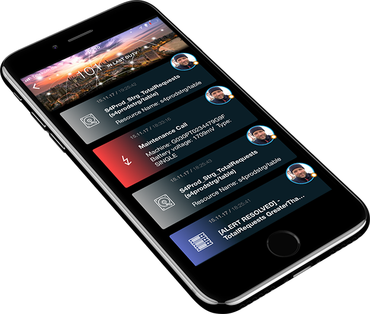

# SIGNL4 Alerting

When critical systems fail or incidents happen, SIGNL4 bridges the ‘last mile’ to your staff, engineers, IT admins and workers ‘in the field’. It adds real-time mobile alerting to your services, systems and processes in no time.

SIGNL4 notifies through persistent mobile push, text and voice calls with acknowledgement, tracking and escalation. Integrated duty and shift scheduling ensures the right people are alerted at the right time.

Through convenient interfaces like email and webhooks, SIGNL4 adds mobile alerting and incident response capabilities to IT, IoT, SCADA and other technical systems.
SIGNL4 thus provides for an up to 10x faster and effective response to critical alerts, major incidents and urgent service requests.



## Inputs

### `team-secret`

**Required**

The url to send the request to.

### `title`

**Required**

Alert title.

### `message`

**Optional**

Alert message.

### `X-S4-Service`

**Optional**

Assigns the alert to the service / system category with the specified name.

### `X-S4-Location`

**Optional**

Transmit location information ("latitude, longitude") with your event and display a map in the mobile app.

### `X-S4-AlertingScenario`

**Optional**

Pass "single_ack" if only one person needs to confirm this alert. Pass "multi_ack" in case this alert must be confirmed by the number of people who are on duty at the time this Singl is raised.

### `X-S4-ExternalID`

**Optional**

If the event originates from a record in a 3rd party system, use this parameter to pass the unique ID of that record. That ID will be communicated in outbound webhook notifications from SIGNL4, which is great for correlation/synchronization of that record with the alert.

### `X-S4-Filtering`

**Optional**

Specify a boolean value of true or false to apply event filtering for this event, or not. If set to true, the event will only trigger a notification to the team, if it contains at least one keyword from one of your services and system categories (i.e. it is whitelisted).

### `X-S4-Status`

**Optional**

If you want to resolve an existing alert by an external id (X-S4-ExternalID), you can add this status parameter. It has two possible values: "new" and "resolved". Sending an event with the status "new" will create a new alert. If you want to resolve a alert, make sure to set the X-S4-Status to "resolved" and provide an external ID via the "X-S4-ExternalID" parameter for the alert(s) you want to resolve. It is only possible to resolve an alert with a provided external id that initially triggered it. If you set the status to any other value the event will be discarded. This means no alert will trigger from it.

## Outputs

### `eventId`

The SIGNL4 event ID of the submitted event.

## Example usage

```yaml
uses: signl4/signl4-action-alert@v1
with:
  team-secret: ${{ secrets.SIGNL4_TEAM_SECRET }}
  title: 'SIGNL4 Alert'
  message: 'Alert from GitHub Actions.'
  X-S4-Service: 'Service',
  X-S4-Location: '52.3984235,13.0544149',
  X-S4-AlertingScenario: 'single_ack',
  X-S4-Filtering: false,
  X-S4-ExternalID: 'A1',
  X-S4-Status: 'new'
```
